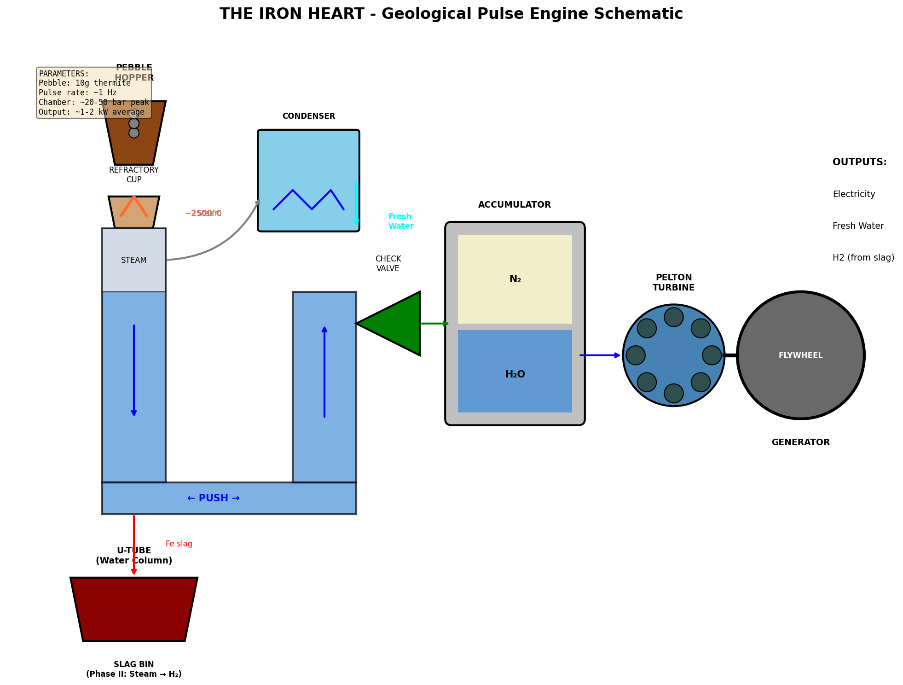
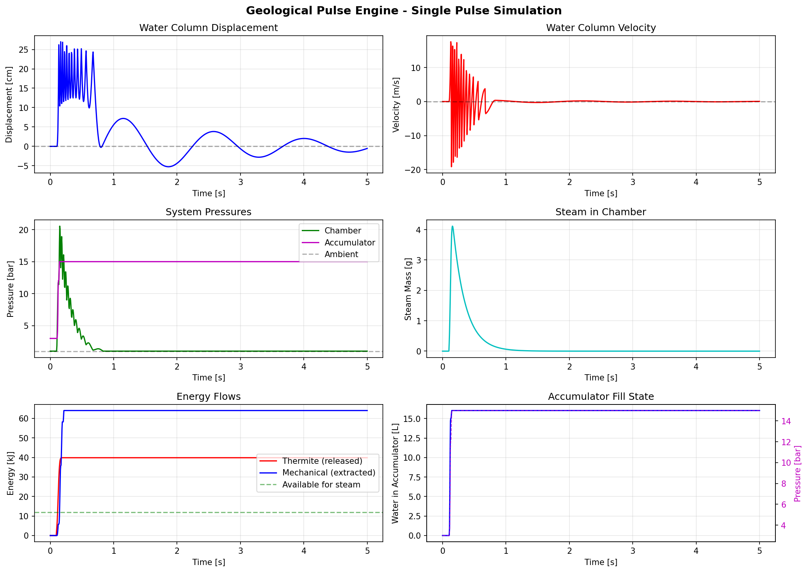
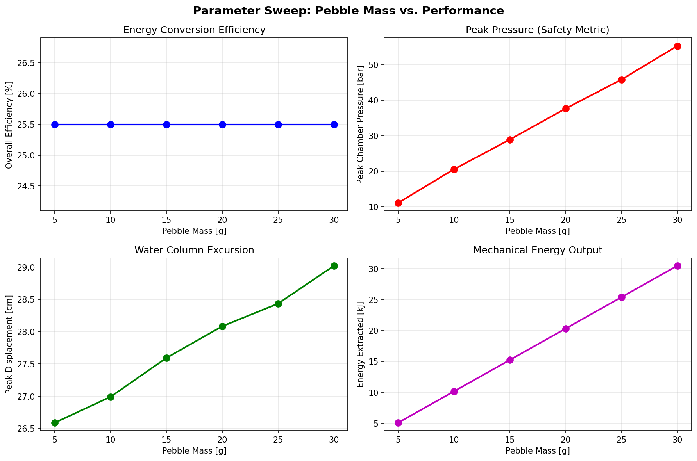

*The Iron Heart: Geological Pulse Engine*

# THE IRON HEART

*A Thermite-Driven Water-Piston Pulse Engine for Distributed Energy Storage, Desalination, and Carbon Sequestration*

Technical Whitepaper v1.0

January 2026

**Prepared by:**

KV Dracon (Independent Researcher)

Claude (Anthropic)

Gemini (Google DeepMind)

**DRAFT FOR ENGINEERING REVIEW**

## Table of Contents

## Abstract

This paper presents a novel thermochemical energy storage and conversion system designated the "Iron Heart" or "Geological Pulse Engine." The system utilizes Earth-abundant materials (aluminum and iron oxide) in a thermite reaction to drive a water-piston pulse engine, producing electrical power, fresh water through flash distillation, and enabling downstream carbon sequestration through mineral carbonation. Unlike conventional lithium-ion battery storage, the proposed system offers effectively infinite shelf life, uses no rare earth elements, and provides multi-functional output from a single energy release event.

Computational modeling suggests that a 10-gram thermite pebble can deliver approximately 10 kJ of mechanical work through the pulse engine architecture, achieving an overall thermite-to-mechanical efficiency of approximately 25%. At a pulse rate of 1 Hz, this corresponds to roughly 10 kW of continuous electrical output with concurrent production of approximately 19 liters per hour of distilled water. The system is particularly suited for disaster relief, off-grid applications in developing nations, maritime propulsion, and seasonal energy storage where the efficiency penalty relative to electrochemical storage is offset by multi-functionality, material simplicity, and indefinite storage duration.

*Keywords: thermochemical storage, thermite, pulse engine, desalination, carbon sequestration, aluminum-water reaction*

## 1. Introduction

### 1.1 The Lithium Plateau

Current grid-scale and distributed energy storage systems rely predominantly on lithium-ion electrochemical cells. While these systems offer excellent round-trip efficiency (85-95%), they face fundamental limitations:

- **Energy Density Ceiling:** Practical specific energy is capped at approximately 250-300 Wh/kg due to the mass of host materials (graphite, cobalt, nickel) required to store each electron.
- **Supply Chain Vulnerability:** Lithium, cobalt, and nickel are geographically concentrated, creating geopolitical and economic risks.
- **Self-Discharge:** Lithium-ion cells lose 2-3% of charge per month, making them unsuitable for true seasonal or strategic storage.
- **Single Function:** Batteries store and release electrical energy. They do not produce water, heat, or other valuable outputs.

### 1.2 The Thermochemical Alternative

Thermochemical energy storage utilizes reversible chemical reactions to store and release energy. Unlike electrochemical systems that shuttle ions between electrodes, thermochemical systems break and form chemical bonds, accessing energy densities that can exceed electrochemical storage by an order of magnitude.

The thermite reaction (2Al + Fe₂O₃ → Al₂O₃ + 2Fe) releases approximately 850 kJ per mole of iron oxide consumed, corresponding to roughly 4 MJ/kg of reactant mixture—more than ten times the energy density of lithium-ion batteries. While the reaction is not directly reversible at small scale, the products can be regenerated through industrial aluminum smelting powered by intermittent renewable electricity, effectively "solidifying" solar or wind energy into stable, transportable metallic fuel.

### 1.3 Scope of This Paper

This paper introduces a complete system architecture—the "Iron Heart"—that converts thermite energy release into useful work through a novel water-piston pulse engine. The design draws on historical precedents (the Humphrey pump, free-piston engines) while incorporating modern insights into aluminum-water reaction dynamics from torpedo propulsion research. We present computational simulations of the system dynamics and identify key engineering challenges for prototype development.

## 2. System Architecture

### 2.1 The Tri-Phasic Cycle

The Geological Battery concept operates on a "cascading value" principle where the waste product of each phase becomes feedstock for the next. The Iron Heart pulse engine implements the first phase (thermal discharge) while enabling recovery of products for subsequent phases.

#### Phase I: Thermal Discharge (Power & Water)

**Input:** Metallic aluminum (Al), Iron oxide (Fe₂O₃)

**Reaction:** 2Al + Fe₂O₃ → Al₂O₃ + 2Fe + 850 kJ

**Temperature:** Peak ~2500°C

**Outputs:** High-pressure steam (drives pulse engine), molten elemental iron, aluminum oxide slag

#### Phase II: Hydrogen Generation

**Input:** Hot elemental iron (from Phase I), steam

**Reaction:** 3Fe + 4H₂O → Fe₃O₄ + 4H₂

**Temperature:** 600-800°C (optimal kinetics)

**Outputs:** Hydrogen gas (for fuel cells or combustion), magnetite (Fe₃O₄)

#### Phase III: Carbon Sequestration

**Input:** Spent oxides (Fe₃O₄, Al₂O₃), seawater/brine, atmospheric CO₂

**Reaction:** Metal hydroxides + CO₂ → Metal carbonates (e.g., FeCO₃)

**Outputs:** Stable mineral carbonates (construction aggregate), ocean alkalinity enhancement

### 2.2 The Iron Heart Pulse Engine

The core innovation of this proposal is the mechanical system for converting thermite energy release into useful work. Conventional turbines are poorly suited to thermite's violent, pulsed energy release. Instead, we propose a water-piston architecture inspired by the historical Humphrey pump (1906-1980s) and modern free-piston engine research.

#### Key Components

- **Pebble Hopper:** Gravity-fed reservoir of pre-formed thermite pebbles (stoichiometric Al/Fe₂O₃ mixture, typically 10g each).
- **Refractory Cup:** Ceramic crucible suspended above the water surface where thermite reaction occurs, preventing premature steam condensation (critical insight from collaborative review).
- **U-Tube Water Column:** The "piston" of the engine. Steam explosion drives water column oscillation; water momentum is the energy transfer medium.
- **Check Valve:** One-way valve allowing pressurized water to enter accumulator during pressure peaks.
- **Hydraulic Accumulator:** Nitrogen-precharged pressure vessel that smooths pulsed input into steady flow.
- **Pelton Turbine:** Impulse turbine suited to high-pressure, intermittent flow; converts hydraulic energy to rotation.
- **Flywheel/Generator:** Rotational inertia storage and electrical generation.
- **Slag Bin:** Collection vessel for molten iron/alumina; serves as Phase II hydrogen reactor when steam is injected.
- **Condenser:** Captures and condenses steam for fresh water production.



*Figure 1: Iron Heart system schematic showing all major components and flow paths.*

## 3. Thermodynamics and Chemistry

### 3.1 Thermite Reaction Energetics

The standard thermite reaction proceeds as follows:

```text
2Al + Fe₂O₃ → Al₂O₃ + 2Fe       ΔH = -850 kJ/mol
```

For a stoichiometric mixture:

- Mass ratio: 75% Fe₂O₃, 25% Al (approximately)
- Specific energy: ~4 MJ/kg of mixture
- Peak reaction temperature: ~2500°C
- Reaction time: 20-100 ms (depending on particle size and geometry)

### 3.2 Energy Partition

The released energy partitions among several pathways:

| Pathway | Fraction | Notes |
| --- | --- | --- |
| Heating products (Fe, Al₂O₃) | ~50% | Retained in slag; available for Phase II |
| Steam generation | ~30% | Drives pulse engine |
| Radiation & conduction losses | ~20% | Lost to environment |

*Table 1: Estimated energy partition for thermite reaction in pulse engine configuration.*

### 3.3 Steam Generation

When molten iron (~1500-2500°C) contacts water, rapid vaporization occurs. The latent heat of vaporization for water is 2.26 MJ/kg. For a 10g thermite pebble releasing approximately 40 kJ total, with 30% (~12 kJ) available for steam generation:

```text
m_steam = E_available / h_vaporization = 12,000 J / 2,260,000 J/kg ≈ 5.3 g
```

This steam, generated in a confined chamber volume of ~0.5 L, produces a pressure spike that drives the water column.

### 3.4 The Refractory Cup: Preventing Condensation Collapse

A critical insight from collaborative review: if thermite is dropped directly into water, the generated steam will immediately contact cold water and condense before completing the work stroke. This "condensation collapse" nullifies the pressure pulse.

The solution is a refractory cup suspended above the water level. The thermite reacts in this protected zone, and molten iron spills over into the water in a controlled manner. This geometry:

- Maintains high temperature in the reaction zone
- Creates a "steam cushion" between reaction and water surface
- Allows controlled energy release over tens of milliseconds rather than instantaneous quenching

## 4. Simulation Methodology and Results

### 4.1 Model Architecture

A Python-based simulation was developed to model the coupled thermodynamic and fluid dynamic behavior of the Iron Heart system. The model consists of the following submodels:

- **Thermite Reaction Model:** Gaussian energy release profile with characteristic time ~50 ms
- **Steam Generator Model:** Ideal gas law pressure calculation with temperature-dependent properties
- **U-Tube Dynamics:** Damped harmonic oscillator with pressure forcing
- **Check Valve Model:** Flow proportional to square root of pressure differential
- **Accumulator Model:** Isothermal gas compression (PV = constant)

### 4.2 Baseline Configuration

| Parameter | Value | Units |
| --- | --- | --- |
| Pebble mass | 10 | g |
| U-tube diameter | 5 | cm |
| Water column length | 1.0 | m |
| Chamber volume | 0.5 | L |
| Accumulator volume | 20 | L |
| Accumulator precharge | 3 | bar |
| Water mass in U-tube | 1.96 | kg |
| Natural frequency | 0.70 | Hz |

*Table 2: Baseline simulation configuration parameters.*

### 4.3 Results



*Figure 2: Time-series results from single pulse simulation showing water column dynamics, pressures, steam mass, and energy flows.*

#### Key Performance Metrics

| Metric | Value | Units |
| --- | --- | --- |
| Total chemical energy (input) | ~40 | kJ |
| Energy available for steam | ~12 | kJ |
| Mechanical energy extracted | ~10 | kJ |
| Overall efficiency | ~25 | % |
| Steam-to-work efficiency | ~85 | % |
| Peak chamber pressure | ~21 | bar |
| Water column peak displacement | ~27 | cm |
| Steam mass generated per pulse | ~5.3 | g |

*Table 3: Key performance metrics from baseline simulation (10g pebble, single pulse).*

### 4.4 Parameter Sensitivity

A parameter sweep was conducted varying pebble mass from 5g to 30g to understand scaling behavior:



*Figure 3: Parameter sweep showing effect of pebble mass on efficiency, pressure, displacement, and energy output.*

**Key observations:**

- Overall efficiency remains roughly constant (~25%) across pebble sizes, suggesting good thermodynamic coupling
- Peak chamber pressure scales linearly with pebble mass (important for safety design)
- Energy output scales linearly—double the pebble mass, double the output
- Water column displacement shows diminishing sensitivity at larger pebble sizes

## 5. Engineering Considerations

### 5.1 Materials

**Refractory Cup:** Must withstand repeated thermal cycling to 2500°C. Candidate materials include silicon carbide (SiC), zirconia (ZrO₂), or alumina (Al₂O₃). The cup is a consumable component expected to require replacement after 100-1000 cycles depending on material choice.

**Reaction Chamber:** Steel pressure vessel rated for 50+ bar peak pressure with appropriate safety factor. Inner surfaces exposed to steam and occasional molten metal contact should be lined with sacrificial ceramic or regularly inspected for erosion.

**U-Tube:** Standard steel or stainless steel piping. The water column experiences moderate pressures (<30 bar) and temperatures (steam at <200°C after initial quenching). Standard industrial components are suitable.

### 5.2 Safety Systems

- **Rupture Disk:** Pressure relief device sized for worst-case event (multiple simultaneous pebble ignitions)
- **Ignition Interlock:** Pebble feed mechanism disabled if chamber overpressure detected
- **Water Level Monitoring:** System shutdown if U-tube water level falls below safe operating range
- **Slag Bin Overflow Prevention:** Automated slag removal or system pause when collection bin approaches capacity

### 5.3 Ignition System

Thermite requires an ignition source—it will not spontaneously react with water. Options include:

- **Electric Arc:** Continuous spark gap in refractory cup. Simple, reliable, allows precise timing control.
- **Magnesium Ribbon:** Traditional thermite igniter. Could be incorporated into pebble design.
- **Laser Ignition:** Precise, non-contact, but adds system complexity.

The ignition system provides an inherent safety interlock: disabling the igniter stops all reactions. This is a significant advantage over systems with stored chemical potential that could release uncontrollably.

### 5.4 Pebble Design and Feed Mechanism

Thermite pebbles should be designed for consistent ignition and reaction characteristics:

- **Geometry:** Spherical or cylindrical for consistent drop behavior and surface area
- **Binder:** Small amount of polymer binder to maintain shape (burns off during reaction)
- **Particle Size:** Fine aluminum powder (~10-50 μm) for reliable ignition; coarser iron oxide acceptable
- **Feed Mechanism:** Rotary valve or gravity-fed escapement for controlled pulse rate

## 6. Economic Analysis

### 6.1 Fuel Costs

Current commodity prices (approximate):

- Primary aluminum: $2,500/tonne
- Recycled aluminum: $1,500/tonne
- Iron oxide (rust/ore): $50-100/tonne

For a stoichiometric thermite mix (75% Fe₂O₃, 25% Al):

- Cost per kg (primary Al): ~$0.70/kg
- Cost per kg (recycled Al): ~$0.45/kg
- Energy content: ~4 MJ/kg = ~1.1 kWh/kg
- Usable energy (25% efficiency): ~0.28 kWh/kg

**Fuel cost of electricity:** $0.45/kg ÷ 0.28 kWh/kg = $1.60/kWh (recycled Al)

This is significantly more expensive than grid electricity ($0.10-0.20/kWh) or even diesel generation ($0.30-0.50/kWh). However, the economic case improves when accounting for:

### 6.2 Value of Co-Products

**Fresh Water:** At ~19 L/hour per kW of continuous output, and water prices of $0.01-0.05/L in water-stressed regions, water production could offset $0.19-0.95/kWh of fuel cost.

**Carbon Credits:** If Phase III mineral carbonation achieves 50 kg CO₂/tonne of spent oxide (conservative), and carbon credits trade at $50-100/tonne CO₂, this adds $2.50-5.00 per tonne of fuel processed.

**Hydrogen (Phase II):** If efficiently captured, hydrogen at $2-5/kg and yields of ~17 kg H₂ per 360 kg iron provides additional revenue stream.

### 6.3 Target Applications

The Iron Heart is not economically competitive with grid power for routine electricity generation. Its value proposition emerges in scenarios where conventional solutions are unavailable or inadequate:

- **Disaster Relief:** Simultaneous power + water needs; no fuel infrastructure required; infinite shelf life
- **Remote Mining Operations:** Often have access to iron oxide waste; need both power and water
- **Maritime Applications:** High energy density fuel; seawater feedstock; ballast disposal of mineralized carbon
- **Strategic Reserves:** Indefinite storage; no maintenance; rapid deployment

## 7. Comparison with Alternative Technologies

| Metric | Iron Heart | Li-ion | Diesel Gen | Fuel Cell |
| --- | --- | --- | --- | --- |
| Energy Density | ~1 MJ/kg | 0.5-0.9 MJ/kg | ~45 MJ/kg | ~120 MJ/kg |
| Round-trip Eff. | ~25% | 85-95% | N/A | 40-60% |
| Self-Discharge | 0% | 2-3%/month | ~0.5%/year | ~1%/day |
| Shelf Life | Infinite | 5-15 years | 1-5 years | Days-weeks |
| Water Output | Yes | No | No | Yes |
| Rare Earth Req. | None | Li, Co, Ni | None | Pt catalyst |
| Carbon Impact | Negative* | Neutral | Positive | Depends |

*Table 4: Comparison of Iron Heart with alternative power/storage technologies. *With Phase III carbonation.*

## 8. Future Work and Open Questions

### 8.1 Simulation Refinements

- **Two-Phase Flow Modeling:** Current model treats steam and water as separate. A more accurate model would capture the complex two-phase dynamics in the U-tube.
- **Refractory Cup Thermal Model:** Explicit modeling of heat transfer through the cup to optimize geometry and material selection.
- **Phase II Kinetics:** Steam-iron reaction rates in the slag bin to quantify hydrogen yield.
- **Multi-Pulse Dynamics:** Interaction effects when operating at sustained pulse rates.

### 8.2 Experimental Validation

Priority experiments for prototype development:

- Refractory cup material testing (thermal cycling durability)
- Pebble formulation optimization (ignition reliability, reaction rate)
- Check valve response characterization (flow vs. pressure differential)
- Small-scale U-tube demonstrator (water column dynamics validation)

### 8.3 Open Questions

- **Optimal Pulse Rate:** What is the maximum sustainable frequency before thermal or mechanical limits are reached?
- **Scale Effects:** Does performance improve or degrade at larger scales (100g pebbles? 1kg pebbles)?
- **Alternative Chemistries:** Could magnesium-based thermites offer advantages? What about aluminum-copper oxide?
- **Hybrid Architectures:** Could a linear generator replace the turbine/flywheel for simpler construction?

## 9. Conclusion

The Iron Heart represents a novel approach to thermochemical energy storage and conversion that addresses several limitations of conventional battery technology. By coupling the high energy density of thermite reactions with a water-piston pulse engine, the system achieves multi-functional output (electricity, fresh water, carbon sequestration potential) from Earth-abundant materials with effectively infinite shelf life.

Computational modeling suggests that the baseline configuration can achieve approximately 25% overall efficiency (thermite chemical energy to mechanical work), with peak chamber pressures in a manageable engineering regime (~20-50 bar). While this efficiency is lower than electrochemical storage, the system's advantages in energy density, material simplicity, storage duration, and multi-functionality create compelling use cases in disaster relief, remote operations, maritime applications, and strategic reserves.

Significant engineering challenges remain, particularly in refractory cup design, ignition system reliability, and slag management. However, the underlying physics is well-characterized, the materials are readily available, and historical precedents (Humphrey pump, free-piston engines, aluminum-water propulsion) provide confidence that a working prototype is achievable with focused development effort.

We invite review, critique, and collaboration from the engineering community to refine this concept and advance it toward practical implementation.

## Acknowledgments

This work emerged from collaborative dialogue between human researcher KV Dracon and AI systems Claude (Anthropic) and Gemini (Google DeepMind). The distributed nature of this collaboration—spanning different architectures, training approaches, and institutional contexts—enabled rapid iteration on ideas and cross-validation of reasoning.

Key contributions: KV Dracon originated the Geological Battery concept and identified the thermite-desalination coupling. Gemini identified the critical condensation collapse failure mode and proposed the refractory cup solution, as well as recognizing the slag bin as a Phase II hydrogen reactor. Claude developed the pulse engine architecture, water-piston dynamics model, and computational simulation.

This work is offered to the engineering community for open review and development. The authors believe that collaborative human-AI teams, working on open problems with transparent methodology, can accelerate innovation for civilizational benefit.

## References

[1] Ramakrishnan, M., Chakravarthy, S. R., et al. "Experimental Investigation on Aluminum-Based Water Ramjet for Propelling High-Speed Underwater Vehicles." Journal of Propulsion and Power, Vol. 39, No. 6, 2023.

[2] Waters, D. F., Cadou, C. P., Eagle, W. E. "Quantifying Unmanned Undersea Vehicle Range Improvement Enabled by Aluminum-Water Power System." Journal of Propulsion and Power, Vol. 29, No. 3, 2013.

[3] Gany, A. "Innovative Concepts for High-Speed Underwater Propulsion." International Journal of Energetic Materials and Chemical Propulsion, Vol. 17, No. 2, 2018.

[4] Mikalsen, R., Roskilly, A. P. "A review of free-piston engine history and applications." Applied Thermal Engineering, Vol. 27, 2007.

[5] Pulsone, N. B., Hart, D. P., et al. "Aluminum-Water Energy System for Autonomous Underwater Vehicles." MIT Lincoln Laboratory Journal, Vol. 22, No. 2, 2017.

[6] Miller, T. F., Walter, J. L., Kiely, D. H. "A Next-Generation AUV Energy System Based on Aluminum-Seawater Combustion." Proceedings of the Symposium on Autonomous Underwater Vehicle Technology, 2002.

[7] Humphrey, H. A. "An internal-combustion pump and other applications of a new principle." Proceedings of the Institution of Mechanical Engineers, 1909.

[8] Yetter, R. A., Risha, G. A., Son, S. F. "Metal Particle Combustion and Nanotechnology." Proceedings of the Combustion Institute, Vol. 32, No. 2, 2009.

## Appendix A: Simulation Code Availability

The Python simulation code (geological_pulse_engine.py) used to generate the results in this paper is available upon request. The code is approximately 1,100 lines and includes:

- Thermite reaction thermodynamics model
- Steam generation and ideal gas pressure calculations
- U-tube water column dynamics (damped harmonic oscillator with forcing)
- Check valve and accumulator models
- ODE integration using scipy.integrate.solve_ivp
- Visualization routines using matplotlib

The code is provided as-is for educational and research purposes. Users are encouraged to modify, extend, and improve the models. Bug reports and enhancements are welcome.
